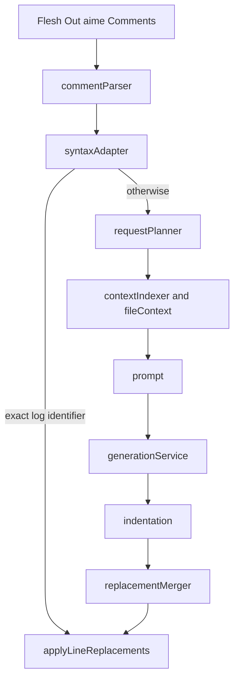

# Agent notes

Read this file before you change Pseudini. Then read `README.md` for usage, `CHANGELOG.md` for
history, `benchmarks/RESULTS.md` for the default model, and `OBSOPS.md` only when you debug
runtime or hardware.

## Goal

A developer writes the implementation idea as pseudocode. The AI supplies language syntax that
fits the current file. The developer stays responsible for architecture, naming, and correctness.

The comment marker is `aime:`. The product is a Cursor extension (VS Code API). Do not turn
Pseudini into a multi-file agent, a chat copilot, or a full-file rewriter except the dedicated
whole-file command.

## Non-goals and hard limits

- Change only `aime:` comment ranges, or the whole-file command target.
- Read authoritative source context only from the active file.
- One command run produces one undoable editor edit.
- Do not log source, prompts, generated code, or API keys.
- Do not store secrets in `.cursor/pseudini-config.json`.
- Do not restore `vscode.lm` or the Cursor CLI agent. Both were removed. Local Ollama is the
  generation path. See `CHANGELOG.md`.

## How a comment becomes code



Whole-file conversion uses `src/wholeFile.ts` and sequential 50-line chunks. It does not use the
comment parser.

## Most important files

| File | Role |
| ---- | ---- |
| `src/extension.ts` | Activation, commands, progress, document-version guard, apply edits, indent model output |
| `src/commentParser.ts` | Find `aime:` instructions, including multiline line-comments |
| `src/syntaxAdapter.ts` | Deterministic `log identifier` path; skip the model |
| `src/requestPlanner.ts` | Split comments over 600 words; token budgets |
| `src/fileContext.ts` | Live facts and scoped source windows |
| `src/contextIndexer.ts` / `src/contextCache.ts` | `.aime/cache-v1/` hash-invalidated facts |
| `src/prompt.ts` | Implementation prompt and ordered JSON replacements (no `line` from the model) |
| `src/generationService.ts` | Queue, route local vs provider, warm/unload model |
| `src/ollamaClient.ts` | Loopback Ollama chat, schema, timings, `keep_alive: -1` |
| `src/providerApi.ts` | HTTPS Chat Completions; keys in SecretStorage |
| `src/indentation.ts` | Re-apply the comment's indentation after generation |
| `src/configurationService.ts` / `src/projectConfiguration.ts` | Project file + Cursor settings merge |
| `package.json` | Commands, settings, `install:cursor`, tests |
| `.cursor/pseudini-config.json` | This repo's local model override |
| `.vscode/launch.json` | **Run Extension** F5 debug host |

Tests live next to the module name under `test/`. Benchmarks live under `benchmarks/`.

## Configuration

Precedence: `.cursor/pseudini-config.json` → resource-scoped Cursor settings → package defaults.

Optional project fields: `ollamaUrl`, `model`, `largeRequestRoute`, `providerBaseUrl`,
`providerModel`. Unknown keys and invalid JSON fail loudly.

Local Ollama URL must be loopback HTTP/HTTPS without credentials. Provider URL must be HTTPS
without credentials. Default model is `qwen2.5-coder:3b` because it passed the grounded small
fixture; the 1.5B model is faster but incorrect. Details: `benchmarks/RESULTS.md`.

`largeRequestRoute: provider` applies to comments over 50 words and to whole-file chunks. Small
requests stay local.

## Invariants that already bit this project

- Map replacements by array order. Do not let the model choose line numbers.
- Apply `applyCommentIndentation` to model output. The model often returns column-zero code.
- Local Ollama requests are serial. Queue wait is not in the performance log.
- Abort if `document.version` changes during generation.
- `stream: false` for Ollama chat. Keep the model resident while the extension is active.
- Reject redirects on fetch so Authorization headers cannot follow a redirect.
- Cache facts are disposable. The live buffer is authoritative.
- Medium, large, and whole-file local gates did not pass. Do not claim they meet the original
  latency and correctness targets.

## How to work

Fast change-and-test: open this folder, run **Run Extension** (F5). That host compiles first and
overrides the installed copy.

Installed use in other projects: `npm run install:cursor`, then **Developer: Reload Window**.

```sh
npm test
npm run check
```

Do not run the full benchmark suite unless you are changing latency, models, or fixtures. A
focused run is documented in `README.md`.

## When you add a feature

1. Keep the developer as the author of the idea. Automate syntax, not design.
2. Change the smallest module that owns the behavior. Add a test next to that module.
3. If behavior, setup, or conventions change, update `README.md`. Put history in `CHANGELOG.md`.
4. Put observation procedures in `OBSOPS.md`, not in the README.
5. Do not add telemetry that includes source or secrets.
