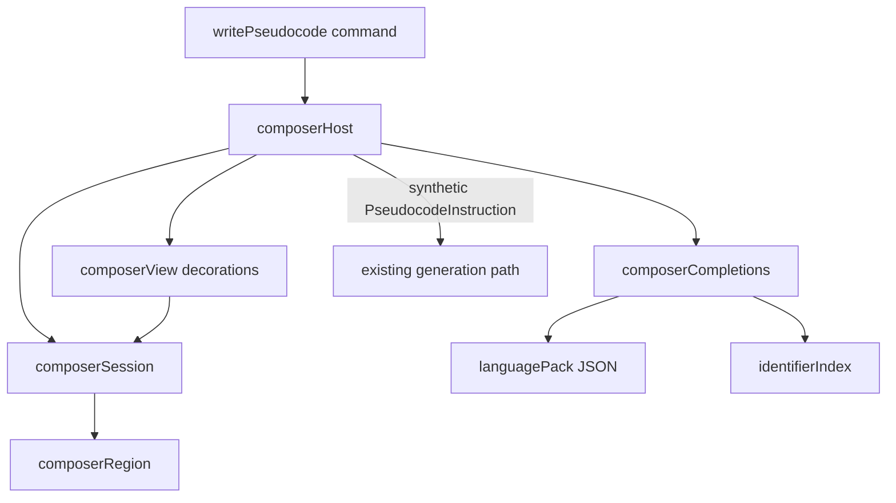

# Inline composer

Architecture for **Pseudini: Write Pseudocode**. Product limits in [`AGENTS.md`](../AGENTS.md)
still apply. Usage and chords are in [`README.md`](../README.md). History is in
[`CHANGELOG.md`](../CHANGELOG.md). Rejected hosts are in
[`dx-pseudocode-input.md`](./dx-pseudocode-input.md).

The public VS Code API has no editor zone widget, inline webview, or way to suppress another
provider's diagnostics for one range. The composer inserts real lines at the caret and wraps them
in temporary language-specific comments. Free prose stays out of static parsing. Diagnostics
outside the region stay active.

## Locked product choices

Do not reopen these without a new review.

| Knob | Choice |
| ---- | ------ |
| Host | Real lines in the active editor, under the caret |
| Region kind | Comment-backed lines |
| Size | Region grows as the developer types new lines |
| Result | Replace the region with generated code |
| Suggestions | Prefix match from the active file, then a language keyword pack |
| Colour | File names the language service reports. Not language keywords |
| Dim rest of file | On while composing or generating |
| Confirm | `Cmd+Enter` / `Ctrl+Enter` |
| Cancel | `Escape`. Empty input is cancel |
| Open keybinding | Not shipped |

## Goal

The developer types the idea in the file. The existing local generation path writes syntax for
that file. One confirm produces one undoable step: `Undo` returns the file to the state it had
before the input opened.

Non-goals: a second model stack, multi-file edits, chat, replacing the `pseudini:` command,
Monaco, webviews, peek widgets, a contribution point for third-party language packs.

## Why the module cut

The extension and the generation path change often. The composer must be easy to throw away or
reshape without touching Ollama, prompts, or comment parsing.

1. **One reason to change per module.** Session logic, buffer math, decorations, completions, and
   language data do not share files.
2. **No `vscode` in the core.** Core modules take strings, line ranges, and language ids. Tests run
   with `node --test`.
3. **Host is a thin adapter.** Editor types, decorations, and keybindings stay out of the core.
4. **Reuse generation as a function call.** The composer builds one synthetic instruction and
   hands it to the same path as `pseudini:`.
5. **Language knowledge is data.** Keyword lists for suggestions are JSON.



## Modules

Files live under `src/composer/` with tests under `test/composer/`.
[`src/extension.ts`](../src/extension.ts) only registers commands and wires dependencies.

| Module | Owns | Must not own |
| ------ | ---- | ------------ |
| `session.ts` | Phase (`composing` / `pending`), `range`, `contentRange`, indent, `origin` | VS Code, decorations, HTTP |
| `region.ts` | Insert wrappers, read draft, replace or remove the range | When to confirm, how code is generated |
| `commentSyntax.ts` | Comment wrapper delimiters for each supported language id | Editor edits, decorations |
| `languagePack.ts` | Map `languageId` to a keyword list for suggestions | Completions UI, colour, session |
| `packs/*.json` | Keyword arrays for `typescript`, `javascript`, JSX/TSX, `html`, `css` | Logic |
| `identifierNames.ts` | Turn semantic tokens and document symbols into a name list, excluding the region | Editor commands, decorations |
| `identifierIndex.ts` | Ask the language providers once per session and cache the names | Which names count, decorations |
| `tokenClassifier.ts` | Offsets of known identifiers, and the unclassified gaps | Grammar parsing, theme colors |
| `instructionAdapter.ts` | Map session draft + range to one `PseudocodeInstruction` | Prompt text, Ollama |
| `host.ts` | One session per editor, document change filter, confirm/cancel | Prompt construction |
| `view.ts` | Stripe, fill, dimming, identifier colour, placeholder, context key | Buffer edits |
| `hint.ts` | Chip and placeholder wording, spinner frames, visibility rule | Decorations, timers |
| `hintView.ts` | Chip decoration, idle timeout, spinner interval | What the chip says, session state |
| `completions.ts` | `CompletionItemProvider` only while the caret is in the region | Session phase transitions |
| `undoHistory.ts` | When an undo replay has restored the origin or run out of stack | VS Code, editors |
| `undoRewind.ts` | Replay `undo`, and `redo` when the rewind fails | Session state, generation |

### Session

```text
ComposerSession
  documentUri
  phase               -- composing | pending
  indentation         -- taken from the caret line when the region opens
  range               -- wrapper start through wrapper end, exclusive
  contentRange        -- editable pseudocode lines only, exclusive
  origin              -- document text and anchor line from before the region existed
```

There is no idle session object. Opening creates `composing`. Confirm moves to `pending`. Success,
failure, cancel, and abort all close the session.

### Region math

Opening inserts an opening delimiter, one empty content line, and a closing delimiter after the
caret. TypeScript, JavaScript, and CSS use `/* ... */`; JSX and TSX use `{/* ... */}`; HTML uses
`<!-- ... -->`. Typing extra newlines grows `contentRange` and `range`. Edits to a delimiter
cancel the session.

The delimiters are painted transparent with collapsed letter spacing. The host moves a caret that
lands on a delimiter line back into `contentRange`. Copying a region line still copies the real
delimiter text, because hiding is decoration only.

### Undo

One `Undo` must return the file to the state it had before the region opened. The editor API cannot
prune undo stops, so the composer replays `undo` until the buffer matches `origin.text`, then
inserts the generated code after `origin.anchorLine`. Cancel uses the same rewind, so a cancelled
draft leaves no history.

The rewind is only safe for edits the composer made itself. Explicit cancel while `composing`, and
confirm success, rewind. Everything else removes the region with a forward delete (`removeRegion`):
an edit outside the region, a change during `pending`, and a failed generation.

`rewindDocumentText` replays `redo` for every `undo` it made when it cannot reach `origin.text`.
Cancel by forward edit deletes only a range `isRegionIntact` still recognizes as the composer's
wrapper. An edit that crosses a delimiter ends the session. Cancel also closes the suggestion
widget.

### Synthetic instruction

The adapter builds one `PseudocodeInstruction`: `line` / `endLine` from the composer range, and
`pseudocode` with leading indent stripped. [`buildFileContext`](../src/fileContext.ts) sees the
live buffer, including the draft. [`applyCommentIndentation`](../src/indentation.ts) uses
`session.indentation`. Word count for `largeRequestRoute` uses the draft.

### Completions and colour

Suggestions are prefix-based and case-insensitive. Sources, in order: names from the active file
outside the wrapper, then keywords from the pack.

Comment wrappers disable the editor's automatic suggestion trigger, so the host drives the widget
itself. After each edit it reads the word before the caret and checks it against the same candidate
rule the provider uses:

- Candidates exist: open the widget. One letter is enough.
- No candidates, or the caret is not at the end of a word: close it. Free prose therefore never
  shows an empty "No suggestions" box.
- Already open for a word the current one extends: leave it alone, because the editor filters an
  open widget by itself. Re-opening only happens at the start of a word, which keeps a deviating
  word such as `ordx` closed until it matches again.

The check awaits the identifier index, then re-reads the caret. A prefix that changed while it
waited belongs to a later call.

Names come from the language providers, never from a text scan.
`identifierIndex.ts` runs `vscode.provideDocumentSemanticTokens` and falls back to
`vscode.executeDocumentSymbolProvider`. When neither answers, no name is coloured.

The index loads once after the region opens. An edit outside the region ends the session. The load
does not block opening; the view paints again when the providers answer.

Each content line splits into two disjoint decoration ranges: provider names use
`symbolIcon.variableForeground`; the rest use `editor.foreground`. Both set `fontStyle: "normal"`
so the comment style does not italicize the draft. Language keywords are not coloured.

### Chrome

`view.ts` dims lines outside the region, paints a left stripe and a tinted fill on the region, and
shows ghost placeholder text on an empty draft:
`describe your code | esc cancels | pseudini ⌘↵` (`Ctrl+↵` off macOS).

[`hintView.ts`](../src/composer/hintView.ts) anchors an `after` chip at the end of the caret's
line. While generating it anchors to the last draft line.

- Composing: `✨ esc cancels | pseudini ⌘↵`
- Pending: `✨ Generating syntax` plus a Braille spinner frame at the end, swapped every 200 ms.
  Decoration render options accept no keyframes.
- The chip appears on typing or a caret move and hides after 2 s of quiet. Pending ignores the
  idle timer. An empty region keeps the chip hidden so it does not stack on the placeholder.
- No API reports that editor text lost focus. Hiding uses the idle timer plus
  `onDidChangeWindowState` and `onDidChangeActiveTextEditor`.

### Document version

In-region typing is an owned edit.

- **Composing:** if every change is inside `contentRange`, update both ranges. If any change
  touches wrapper delimiters or lines outside the region, cancel.
- **Pending:** any document change cancels the run.
- **Save:** cancel and remove the wrapper before the save completes.

### Commands

- `pseudini.writePseudocode` — open at the primary caret
- `pseudini.confirmComposer` / `pseudini.cancelComposer` — when `pseudini.composerActive`

Confirm and cancel chords ship. An open chord does not. Extra cursors are ignored.

## Coupling map

Safe to change without touching generation: decoration look (`view.ts`, `hintView.ts`), keyword
lists (`packs/`), completion ranking (`suggestions.ts`).

Safe to change without touching the composer: Ollama client, provider, schema, queue, comment
parser, whole-file command.

Must stay stable: `PseudocodeInstruction`, `CodeReplacement` order mapping,
`applyCommentIndentation`.

Do not import `composer/*` from `commentParser`, `ollamaClient`, or `prompt`.

## Tests

Live next to the modules under `test/composer/`. Cover region math, session range updates,
the instruction adapter, identifier extraction, pack lookup, suggestion ranking, undo replay,
and hint visibility. Do not add a full benchmark run for composer work.

## Risks

| Risk | Handling |
| ---- | -------- |
| Free prose produces static syntax diagnostics | Temporary comment wrappers |
| A typed closing delimiter ends a block comment | Delimiter edits cancel the session |
| Typing history leaves many undo stops | Replay `undo` to `origin.text`; `redo` back on failure |
| Native comment color hides useful names | Overlay provider names only |
| A language reports no names | Fall back to document symbols |
| `buildFileContext` includes the draft | Measure; strip later only if it causes copy-back |
| `document.version` during pending | Cancel on any change |
