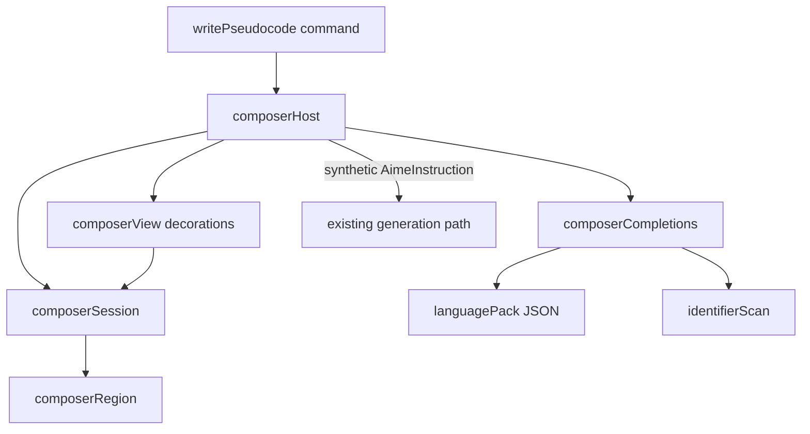

# Inline composer: architecture and implementation plan

Status: implemented. Product limits in [`AGENTS.md`](../AGENTS.md) still apply.

Visual source for the locked look: the canvas at
`~/.cursor/projects/Users-spanyanil-Tools-pseudini/canvases/pseudocode-input-prototype.canvas.tsx`.
Earlier UI options and rejected hosts live in [`dx-pseudocode-input.md`](./dx-pseudocode-input.md).
This file is the implementation source of truth when the two disagree.

## Locked product choices

These match the prototype knobs that passed review. Do not reopen them without a new review.

| Knob | Choice |
| ---- | ------ |
| Host | Real lines in the active editor, under the caret |
| Region kind | Plain lines (not comments, not a scratch buffer, not a webview) |
| Size | Region grows as the developer types new lines |
| Result | Replace the region with generated code |
| Suggestions | On: prefix match from the active file plus a language keyword pack |
| Dim rest of file | On while composing or generating |
| Confirm | `Cmd+Enter` / `Ctrl+Enter` |
| Cancel | `Escape`. Empty input is cancel |
| Open keybinding | Not shipped. User binds **Pseudini: Write pseudocode** |
| Existing command | **Flesh Out aime: Comments** stays |

The public VS Code API has no editor zone widget and no inline webview. The composer therefore
inserts real lines at the caret and decorates them. That is the shippable mechanic, not a demo
shortcut.

## Goal

The developer types the idea in the file. The existing local generation path writes syntax for
that file. One confirm produces one undoable replacement of the composer region.

Non-goals:

- A second model stack, prompt, or JSON schema
- Multi-file edits
- Chat
- Replacing the `aime:` command
- A contribution point for third-party language packs in the first slices
- Monaco, webviews, or peek widgets

## Why the module cut

The extension and the generation path change often. The composer must be easy to throw away or
reshape without touching Ollama, prompts, or comment parsing.

Rules:

1. **One reason to change per module.** Session logic, buffer math, decorations, completions, and
   language data do not share files.
2. **No `vscode` in the core.** Core modules take strings, line ranges, and language ids. Tests run
   with `node --test` like the rest of the repo.
3. **Host is a thin adapter.** `vscode.TextEditor`, decorations, and keybindings live in two files
   at most. If the decoration API fights us, only those files change.
4. **Reuse generation as a function call.** The composer builds one synthetic instruction and
   hands it to the same planner, context, prompt, generation, indent, and apply path as `aime:`.
5. **Language knowledge is data.** Keyword lists are JSON. Adding HTML or CSS is a file, not a
   branch in the session.



## Modules

Place new files under `src/composer/` with tests under `test/composer/`. Do not grow
[`src/extension.ts`](../src/extension.ts) beyond command registration and dependency wiring.

| Module | Owns | Must not own |
| ------ | ---- | ------------ |
| `session.ts` | Phase (`idle` / `composing` / `pending`), region start, line count, indent string, snapshot of the pre-open buffer | VS Code, decorations, HTTP |
| `region.ts` | Pure edits: insert opening line, grow/shrink line count, restore snapshot, replace range with code | When to confirm, how code is generated |
| `languagePack.ts` | Map `languageId` to a keyword list | Completions UI, session |
| `packs/*.json` | Keyword arrays for `typescript`, `javascript`, `javascriptreact`, `typescriptreact`, `html`, `css` | Logic |
| `identifierScan.ts` | Cheap identifier list from document text, excluding the region | Language-server results, network |
| `instructionAdapter.ts` | Map session draft + range to one `AimeInstruction` | Prompt text, Ollama |
| `host.ts` | One session per editor, document change filter, confirm/cancel commands | Prompt construction |
| `view.ts` | Accent stripe, region fill, dimming of other lines, pending label, `pseudini.composerActive` context key | Buffer edits |
| `completions.ts` | `CompletionItemProvider` that no-ops unless the caret is inside the active region | Session phase transitions |

`generationService`, `fileContext`, `prompt`, `requestPlanner`, `indentation`,
`replacementMerger`, and the document-version abort stay where they are. The composer calls them.

### Session shape

```text
ComposerSession
  editorId
  uri
  phase
  indent              -- taken from the caret line when the region opens
  range               -- start line, exclusive end line, 0-based
  preOpenLines        -- snapshot for Escape
  openedAtVersion     -- document.version at insert
```

Allowed transitions: `idle -> composing -> pending -> idle`, and `composing -> idle` on cancel.
`pending -> idle` on success, failure, cancel, or abort.

### Region math

Opening inserts one empty line after the caret, indented with `indent`. Typing extra newlines
grows `range`. Backspacing the last composer line does not close the session; `Escape` does.

Replace-on-confirm deletes `range` and inserts the indented model output in one `editor.edit`.
That edit is the one undoable generation result. User keystrokes while composing are normal
editor undos. Do not try to glue typing and generation into one undo stop.

Cancel restores `preOpenLines` for that span in one edit.

### Synthetic instruction

[`createImplementationPrompt`](../src/prompt.ts) and [`parseModelResponse`](../src/prompt.ts)
already take `AimeInstruction[]`. The adapter builds one instruction:

- `line` / `endLine`: the composer range
- `pseudocode`: the draft text with leading indent stripped

[`buildFileContext`](../src/fileContext.ts) then sees the live buffer, including the draft. That
is acceptable: the draft is the requested replacement. If the model copies the draft back, the
indent step still applies. Do not strip the region from `liveSource` in v1; measure first.

[`applyCommentIndentation`](../src/indentation.ts) already re-bases column-zero model output onto
a captured indent. Pass `session.indent`.

Word count for `largeRequestRoute` uses the draft, same 50-word rule as comments.

### Completions and highlight

Suggestions are prefix-based and case-insensitive. Sources, in order: identifiers from the active
file outside the region, then keywords from the pack. No extra network calls. A later slice may
add language-server items because the text lives in a real document; keep that behind the
completions module so the session does not learn about `vscode.languages`.

Keyword coloring in the region is a decoration overlay on pack words, not a full grammar. Native
`languageId` coloring of the rest of the file stays as Cursor paints it. The overlay exists
because a TS grammar colors identifiers and strings in ways that fight prose.

### Dimming and chrome

`view.ts` sets:

- A whole-document dim decoration minus the region
- A left-edge stripe and a tinted background on the region
- A after-content or overlay label `Pseudini` plus confirm hint on the first region line

If overlay decorations collide with typed text (as the first canvas pass did), keep the label on
the right of the line or in the status bar. Do not cover the caret.

### Document version

[`ensureDocumentUnchanged`](../src/extension.ts) aborts `aime:` if any edit happens during
generation. The composer must treat in-region typing as owned edits.

- **Composing:** apply `workspace.onDidChangeTextDocument`. If every change is inside `range`
  (including newline growth at the range end), update `range` and keep going. If any change
  touches lines outside the region, cancel and restore `preOpenLines`.
- **Pending:** ignore further typed input (read-only on the region via `Type` override, or cancel
  on any change). If `document.version` moves without a session-owned edit, abort and restore.
- **Save while composing:** cancel and restore. Plain lines in a saved file would break the
  buffer. This is the main cost of "plain lines" versus comments.

### Keybindings and context

Contribute commands:

- `pseudini.writePseudocode` — open composer at caret (no selection wrap in v1; first cursor only)
- `pseudini.confirmComposer` — when `pseudini.composerActive`
- `pseudini.cancelComposer` — when `pseudini.composerActive`

Ship confirm and cancel chords (`editorTextFocus && pseudini.composerActive`). Do not ship an
open chord. Multi-cursor: ignore extra cursors; use the primary one.

## Coupling map

Safe to change without touching generation:

- Decoration look (`view.ts`)
- Keyword lists (`packs/`)
- Completion ranking (`completions.ts` + `identifierScan.ts`)

Safe to change without touching the composer:

- Ollama client, provider, schema, queue
- Comment parser and whole-file command

Must stay stable, because both paths use them:

- `AimeInstruction`
- `CodeReplacement` order mapping (model does not pick line numbers)
- `applyCommentIndentation`

Do not import `composer/*` from `commentParser`, `ollamaClient`, or `prompt`.

## Implementation slices

Ship in this order. Each slice is mergeable and testable. Do not start the next slice until the
previous one is usable in the F5 host.

1. **Command + region, no model.** Open inserts a line. Type. Confirm inserts the raw draft at
   the same indent and closes. Escape restores. Proves the loop and undo.
2. **Decorations.** Stripe, fill, dim, pending text. Tune so the caret and placeholder stay
   readable.
3. **Generation.** Adapter → existing `createReplacements` path for one instruction → replace
   region. Progress UI may be a region label instead of a window notification. Abort rules as
   above.
4. **Completions + keyword overlay.** File identifiers and packs. Tests for match and for
   "provider silent outside region".
5. **Language packs for HTML and CSS.** Data only. Confirm indent still looks right in CSS.
6. **Stop.** No contribution point, no comment-region fork, no keep-and-insert-below, until a
   later review.

## Tests

Next to the modules, same style as [`test/commentParser.test.ts`](../test/commentParser.test.ts).

| Slice | Assert |
| ----- | ------ |
| Region | Open, grow, cancel restore byte-for-byte, replace |
| Session | Illegal transitions throw; outside-range change requests cancel |
| Adapter | Draft and range become one instruction; indent stripped from pseudocode |
| Identifier scan | Names from a fixture; region lines omitted |
| Pack lookup | `typescriptreact` gets TS + JSX tag names; unknown id returns empty |
| Completions | Empty list when position is outside a stub session range |

Do not add a full benchmark run for this work. [`AGENTS.md`](../AGENTS.md) reserves that for
latency, models, or fixtures.

## Risks

| Risk | Handling |
| ---- | -------- |
| Plain lines break parse and the language server while composing | Cancel on save; Escape restores; keep sessions short |
| Two undo stops (open region, then generate) | Document as intended. Generation replace is the invariant undo |
| Full TS grammar noise in the region | Keyword overlay only; do not change `languageId` |
| `buildFileContext` includes the draft | Measure; strip later in `fileContext` only if it causes copy-back |
| Decoration APIs differ from the canvas | Slice 2 is a live F5 check, not a canvas check |
| `document.version` during pending | Session-owned vs foreign edits; abort foreign |

## After implementation

When this ships:

- Update [`README.md`](../README.md) with the new command and the confirm/cancel chords
- Record the change in [`CHANGELOG.md`](../CHANGELOG.md)
- Leave observation steps in [`OBSOPS.md`](../OBSOPS.md) if the host needs a runtime check
- Keep this file as architecture; put history in the changelog, not here
